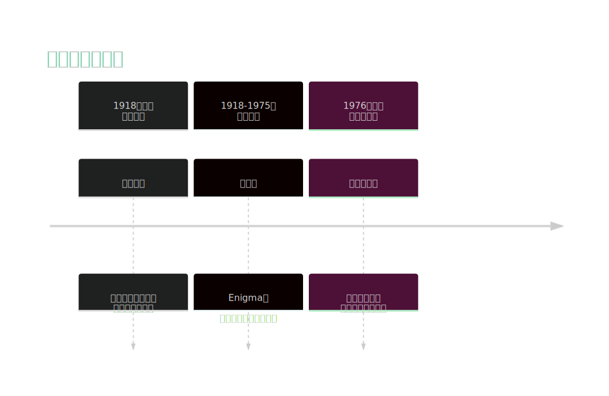

好的，這是一份根據您提供的兩份PDF檔案，進行詳細整合與擴充的筆記，包含專有名詞標記、詳細頁碼索引，以及使用Mermaid繪製的詳細方法與流程圖。

---

# 📘 密碼學形式化安全證明詳細整合筆記

## 第一部分：密碼學基礎 (Cryptography Fundamentals)

### 1.1 密碼學目標 (Classic Goals of Cryptography)
**出處：p.5, p.7, p.8, p.9 (Formal_Security_Proof_Concept.pdf)；p.9 (image.pdf)**

密碼學是研究在**主動破壞者 (Active Disrupter)** 存在下，仍能保持其功能的系統（方案、協定）的學科。

| 目標 | 描述 | 經典類比 |
| :--- | :--- | :--- |
| **完整性 (Integrity)** | 確保訊息在傳輸或儲存過程中未被篡改。 | 信件信封未被開啟。 |
| **真實性 (Authenticity)** | 確認訊息來源的聲稱者確實是發送者。 | 驗證簽名或印章。 |
| **機密性 (Secrecy/Confidentiality)** | 確保訊息內容不被未經授權的個體獲知。 | 將信件內容加密。 |
| **不可否認性 (Non-repudiation)** | 防止發送者事後否認其發送過的訊息行為。 | 具有法律效力的親筆簽名。 |

### 1.2 密碼學歷史演進 (A Brief History of Cryptography)
**出處：p.9 (Formal_Security_Proof_Concept.pdf)**

<!-- ```mermaid
timeline
    title 密碼學演進歷程
    section 1918年前： 古典時期
        古典密碼 : 依賴機制的保密性<br>（置換與代換）
    section 1918-1975： 技術時期
        密碼機 : Enigma等<br>（快速的自動化運算）
    section 1976年後： 現代密碼學
        可證明安全 : 基於計算假設<br>（例如單向函數）
``` -->

---

## 第二部分：可證明安全 (Provable Security)

### 2.1 核心概念與動機 (The Need for Provable Security)
**出處：p.11, p.12 (Formal_Security_Proof_Proof_Concept.pdf)；p.8 (image.pdf)**

- **傳統密碼分析驅動 (Cryptanalysis-driven) 方法的缺陷 (p.12)：**
  1. 提出方案。
  2. 尋找攻擊。
  3. 若找到攻擊，回到步驟1。
  4. 經過多次迭代後，**「宣稱」** 其安全。
  - **問題**：何時停止？結果不一定可信（例如Chor-Rivest方案10年後才被攻破）。

- **可證明安全的願景 (p.24-25)：**
  - **如果** 存在對手能破壞加密方案的機密性，
  - **那麼** 我們就能利用此對手來打破某個計算假設。
  - 這被稱為**歸約證明 (Proof by Reduction)**，也稱為**歸約論安全 (Reductionist Security)**。

### 2.2 可證明安全標準流程 (The Recipe)
**出處：p.13 (Formal_Security_Proof_Concept.pdf)；p.11 (image.pdf)**

<!-- 
```mermaid
flowchart TD
    A[1. 定義安全目標<br>Security Goal] -> B[2. 定義攻擊模型<br>Attack Model]
    B -> C[3. 給出協議<br>Protocol]
    C -> D[4. 定義計算假設<br>Complexity Assumptions]
    D -> E[5. 提供歸約證明<br>Proof by Reduction]
    E -> F[6. 驗證證明<br>Verify Proof]
    F -> G[7. 解釋證明<br>Interpret Proof]
``` 
-->


---

## 第三部分：計算假設與歸約 (Computational Assumptions & Reductions)

### 3.1 為何需要計算假設？ (The Need of Computational Assumptions)
**出處：p.14-16, p.22 (Formal_Security_Proof_Concept.pdf)**

- **無條件安全 (Unconditional Secrecy) 不可能 (p.15-16)：**
  - 密文 $ c = \mathcal{E}_{k_e}(m; r) $ 由公鑰 $ k_e $、訊息 $ m $ 和隨機數 $ r $ 唯一決定。
  - 至少存在**暴力搜尋 (Exhaustive Search)** 攻擊。
- **結論**：我們必須依賴**計算複雜度假設**，假設某些問題在計算上是困難的。

### 3.2 核心計算難題 (Core Computational Hard Problems)
**出處：p.17, p.18, p.75 (Formal_Security_Proof_Concept.pdf)**

| 難題 | 描述 | 應用 |
| :--- | :--- | :--- |
| **整數因數分解<br>(Integer Factoring)** | 給定 $ n = p \cdot q $，找出 $ p $ 和 $ q $。 | RSA 加密與簽章 |
| **RSA 問題<br>(RSA Problem)** | 給定 $ n, e, y $，找到 $ x $ 滿足 $ x^e \equiv y \mod n $。 | RSA 加密 |
| **離散對數問題<br>(Discrete Logarithm - DLog)** | 在循環群 $ G $ 中，給定 $ g, y = g^x $，找到 $ x $。 | ElGamal 加密、DSA |
| **計算性迪菲-赫爾曼問題<br>(Computational Diffie-Hellman - CDH)** | 給定 $ g, g^a, g^b $，計算 $ g^{ab} $。 | Diffie-Hellman 金鑰交換 |
| **判決性迪菲-赫爾曼問題<br>(Decisional Diffie-Hellman - DDH)** | 區分 $ (g^a, g^b, g^{ab}) $ 和 $ (g^a, g^b, g^c) $，其中 $ c $ 是隨機數。 | 語意安全加密 |

### 3.3 歸約證明框架 (Proof by Reduction Framework)
**出處：p.26-27 (Formal_Security_Proof_Concept.pdf)**

<!-- ```mermaid
flowchart TD
    P[困難問題 P]
    A[攻擊者 A<br>攻破方案 S<br>時間 t, 優勢 ε]

    subgraph R [歸約者 B]
        direction TB
        I[輸入: 問題 P 的實例 I]
        S_S[模擬方案 S 的環境]
        A_Sub[將 I 嵌入環境，調用 A]
        E[提取 A 的輸出<br>作為 P 的解]
    end

    I -> S_S
    S_S -> A_Sub
    A_Sub -> A
    A -> E
    E -> O[輸出: 問題 P 的解]

    P -- 若 A 存在 -> R
    O -- 則 B 可解 P -> P
``` -->

- **核心論證 (p.27)**：如果解決問題 $ P $ 可以**歸約 (Reduces to)** 到攻破方案 $ S $，那麼結論是：**如果 $ P $ 是難解的，則方案 $ S $ 就是安全的。**

### 3.4 安全性的三種解讀 (Interpreting Security: Three Flavors)
**出處：p.31-37 (Formal_Security_Proof_Concept.pdf)**

| 類型 | 核心思想 | 關鍵要求 | 實用性 |
| :--- | :--- | :--- | :--- |
| **複雜度理論安全<br>(Complexity-theoretic)** | 沒有多項式時間的對手 | 歸約時間 $ T $ 是多項式級 | 理論可行性，參數可能不實用 |
| **精確安全<br>(Exact Security)** | 明確量化安全損失 | 給出 $ T $ 和 $ \epsilon' $ 的具體表達式 | 可推導出最小金鑰長度，實用性高 |
| **實用安全<br>(Practical Security)** | 安全損失很小 | $ T \approx t $, $ \epsilon' \approx \epsilon $ | 最理想，可直接用於參數設定 |

- **緊緻度 (Tightness) (p.39)**：衡量歸約品質的指標。
  - **緊緻性缺口 (Tightness Gap)**: $ \dfrac{t' \cdot \epsilon}{t \cdot \epsilon'} $
  - 缺口越小，歸約越緊密，從證明推導出的參數就越實用。

---

## 第四部分：安全模型與目標 (Security Models & Notions)

### 4.1 定義安全目標與攻擊模型 (Defining Security Goals & Attack Models)
**出處：p.42 (Formal_Security_Proof_Concept.pdf)**

一個安全概念由兩部分組成：
1.  **安全目標 (Security Goal)**：方案需要保證的屬性（對抗者的目標）。
2.  **攻擊模型 (Attack Model)**：對抗者擁有的能力和資源（例如，能訪問哪些神諭 - Oracles）。

### 4.2 簽章方案的安全概念 (Security Notion for Signature Schemes)
**出處：p.43-45 (Formal_Security_Proof_Concept.pdf)**

- **安全目標**：**存在性不可偽造性 (Existential Unforgeability - EUF)**：對手無法偽造出**任何**一對有效的訊息-簽章對 $ (m', \sigma') $。
- **攻擊模型**：
  - **無訊息攻擊 (No-Message Attack - NMA)**：對手僅知道驗證公鑰。
  - **已知訊息攻擊 (Known-Message Attack - KMA)**：對手擁有一些合法的訊息-簽章對列表。
  - **選擇訊息攻擊 (Chosen-Message Attack - CMA)**：對手可以**主動**請求其選擇的訊息的簽章（最強模型）。

- **標準安全概念**：**EUF-CMA (Existential Unforgeability under Chosen-Message Attacks)**

### 4.3 加密方案的安全概念 (Security Notion for Encryption Schemes)
**出處：p.71-73 (Formal_Security_Proof_Concept.pdf)**

- **安全目標**：
  - **單向性 (One-Way - OW)**：從密文中恢復明文是困難的。**(較弱)**
  - **不可區分性 (Indistinguishability - IND)**：對手無法區分兩個相同長度、不同明文的密文。**(標準目標)**
- **攻擊模型**：
  - **選擇明文攻擊 (Chosen-Plaintext Attack - CPA)**：對手可以加密任何他選擇的明文。
  - **選擇密文攻擊 (Chosen-Ciphertext Attack - CCA/CCA2)**：對手除了CPA能力外，還可以對非挑戰密文進行解密查詢。**(最強模型)**

- **標準安全概念**：**IND-CCA (Indistinguishability under Adaptive Chosen-Ciphertext Attacks)**

#### IND-CCA 安全遊戲流程圖 (p.73)


- 對手的優勢定義為：$ \mathbf{Adv}^{\text{ind-cca}}_{\mathcal{AS}}(A) = \left| \Pr[b' = b] - \frac{1}{2} \right| $

### 4.4 匿名性安全概念 (Anonymity Security Notion)
**出處：p.1, p.3-4 (image.pdf)**

- **目標**：確保受保護的身份（匿名身份 `aid`）無法被連結到其對應的真實身份。
- **安全遊戲 (p.4)**：
  1.  對手選擇兩個真實身份 $ u_0, u_1 $。
  2.  挑戰者隨機選擇一個比特 $ b \xleftarrow{\$} \{0,1\} $，並生成 $ u_b $ 的匿名身份 `aid`。
  3.  對手獲得 `aid`，並輸出一個猜測 $ b' $。
- **對手優勢**：$ \mathbf{Adv}^{\text{anon}}(A) = \left| \Pr[b' = b] - \frac{1}{2} \right| $
- 若對所有多項式時間的對手，其優勢均可忽略，則系統滿足**匿名性安全**。

### 4.5 理想化安全模型 (Idealized Security Models)
**出處：p.46-50 (Formal_Security_Proof_Concept.pdf)**

當標準模型中的證明過於困難時，會使用理想化模型來分析方案。

| 密碼原語 | 理想化模型 | 核心思想 |
| :--- | :--- | :--- |
| **雜湊函數 (Hash Function)** | **隨機預言模型 (Random Oracle Model - ROM)** | 將雜湊函數視為一個完全隨機的函數。 |
| **分組密碼 (Block Cipher)** | **理想密碼模型 (Ideal Cipher Model)** | 將分組密碼視為一個由金鑰索引的完全隨機置換族。 |
| **有限循環群 (Finite Cyclic Group)** | **泛群模型 (Generic Group Model)** | 對手只能通過群運算（如群乘法）來操作群元素。 |

- **注意**：在ROM中證明的方案，在實際中使用具體雜湊函數（如SHA-3）實例化時，其安全性是一個**啟發式 (Heuristic)**，並非嚴格的證明。
### 4.6 RSA-OAEP的安全分析 (Security Analysis of RSA-OAEP)

**安全性定理 (Fujisaki-Okamoto-Pointcheval-Stern, 2000):**
$$Adv_{RSA-OAEP}^{ind-cca}(A) \leq 2 \cdot \sqrt{Adv_{n,e}^{rsa}(B)}$$

**實際安全計算 (p.80):**
- 1024位元：$t' \leq 2^{133}$，NFS需 $2^{80}$ → **不安全**
- 2048位元：$t' \leq 2^{135}$，NFS需 $2^{111}$ → **不安全**
- 4096位元：$t' \leq 2^{137}$，NFS需 $2^{149}$ → **安全**

**結論：** RSA-OAEP需要4096位元金鑰，且歸約不夠緊緻。
### 4.7 OAEP++的緊緻安全改進 (Tight Security with OAEP++)

Jonsson (2002) 提出OAEP++，在理想密碼模型下獲得線性歸約：

**安全優勢：**
- 1024位元：$t' \leq 2^{76}$，NFS需 $2^{80}$ → **安全**
- 2048位元：$t' \leq 2^{78}$，NFS需 $2^{111}$ → **安全**
- 4096位元：$t' \leq 2^{80}$，NFS需 $2^{149}$ → **安全**

**結論：** OAEP++對所有實用金鑰長度都提供足夠安全性。

---

## 第五部分：案例研究 - FDH簽章與遊戲跳躍證明 (Case Study: FDH Signatures & Game-Hopping Proof)

### 5.1 完整域雜湊簽章 (Full-Domain Hash Signature)
**出處：p.51-53 (Formal_Security_Proof_Concept.pdf)**

- **構造**：
  - 金鑰生成：產生陷門單向置換 $ f $（公鑰）及其逆 $ f^{-1} $（私鑰）。
  - 簽章：$ \sigma \leftarrow f^{-1}(H(m)) $，其中 $ H: \{0,1\}^* \to X $。
  - 驗證：檢查 $ f(\sigma) \overset{?}{=} H(m) $。

- **安全性定理 (ROM中)**：
  對於任何在EUF-CMA遊戲中運行時間為 $ t $，進行 $ q_s $ 次簽章查詢和 $ q_h $ 次隨機預言查詢的對手 $ A $，存在一個對手 $ B $ 滿足：
  $$
  \mathbf{Adv}_{\text{FDH}}^{\text{euf-cma}}(A) \leq (q_h + q_s + 1) \cdot \mathbf{Adv}_{f}^{\text{ow}}(B)
  $$
  其中 $ B $ 的運行時間 $ t' \approx t + (q_h + q_s) \cdot T_f $，$ T_f $ 是計算 $ f $ 的時間。

### 5.2 FDH的遊戲跳躍證明 (Game-Hopping Proof for FDH)
**出處：p.54-65 (Formal_Security_Proof_Concept.pdf)**

好的，這裡是針對 **p.54-65 (Formal_Security_Proof_Concept.pdf)** 中 **FDH 簽章方案遊戲跳躍證明 (Game-Hopping Proof)** 的極詳細分解。

這部分內容是形式化安全證明的核心，展示了如何將一個「攻擊簽章方案」的對手，轉換成一個「攻破底層數學難題」的對手。
### 5.3 FDH安全性的實際解讀 (Practical Interpretation of FDH Security)

**安全參數計算範例 (p.68-69):**
假設實際安全界限為：
- 最多 $2^{75}$ 次運算 ($t$)
- 最多 $2^{55}$ 次雜湊查詢 ($q_h$)  
- 最多 $2^{30}$ 次簽章查詢 ($q_s$)

根據定理：$Adv_{FDH}^{euf-cma}(A) \leq (q_h + q_s + 1) \cdot Adv_f^{ow}(B)$

**解讀：** 如果能攻破FDH方案，就能在時間 $t' \leq 2^{130} + 2^{110} \cdot T_f$ 內反轉RSA函數。

與NFS（數體篩法）分解難度比較：
- 1024位元：$t' \leq 2^{140}$，但NFS只需 $2^{80}$ → **不安全**
- 2048位元：$t' \leq 2^{143}$，但NFS需 $2^{111}$ → **不安全**  
- 4096位元：$t' \leq 2^{146}$，但NFS需 $2^{149}$ → **安全**

**結論：** RSA-FDH需要至少4096位元的金鑰才安全。
### 5.4 FDH的緊緻歸約改進 (Improved Tight Reduction for FDH)

Coron (2000) 提出了更緊緻的歸約：

**改進定理：**
$$Adv_{FDH}^{euf-cma}(A) \leq q_s \cdot e \cdot Adv_f^{ow}(B)$$

其中 $e$ 是自然對數的底。

**實際影響：**
- 1024位元：$t' \leq 2^{105}$，NFS需 $2^{80}$ → **不安全但接近**
- 2048位元：$t' \leq 2^{107}$，NFS需 $2^{111}$ → **安全**
- 4096位元：$t' \leq 2^{109}$，NFS需 $2^{149}$ → **安全**

**結論：** 使用改進歸約後，RSA-FDH只需2048位元金鑰即安全。
---

## 🧠 FDH簽章安全性證明詳解：遊戲跳躍法

### 證明目標

在**隨機預言模型 (Random Oracle Model)** 下，將 **FDH 簽章的 EUF-CMA 安全性** 歸約到 **底層陷門單向置換 $ f $ 的單向性 (One-Wayness)**。

**定理 (p.52-53):**
對於任何 EUF-CMA 對手 $ A $，存在一個單向性對手 $ B $，使得：
$$
\mathbf{Adv}_{\text{FDH}}^{\text{euf-cma}}(A) \leq (q_h + q_s + 1) \cdot \mathbf{Adv}_{f}^{\text{ow}}(B)
$$
其中：
- $ q_h $: 對手 $ A $ 對隨機預言 (雜湊函數 $ H $) 的查詢次數。
- $ q_s $: 對手 $ A $ 對簽章神諭的查詢次數。
- $ B $ 的運行時間 $ t' \approx t + (q_h + q_s) \cdot T_f $ ($ T_f $ 是計算 $ f $ 的時間)。

---

### 證明方法：遊戲跳躍 (Game-Hopping)

證明定義了 **6個連續的遊戲 (Game $ G_0 $ 到 $ G_5 $)**。每個遊戲都在相同的機率空間中，但規則略有不同。我們追蹤在每個遊戲中，對手 $ A $ 成功偽造簽章的事件 $ S_i $ 的機率。

<!-- ```mermaid
flowchart TD
    G0["G0: 真實的 EUF-CMA 遊戲<br>Pr[S₀] = Adv(A)"]
    G1["G1: 完美模擬神諭<br>Pr[S₁] = Pr[S₀]"]
    G2["G2: 猜測關鍵查詢索引 c<br>Pr[S₂] ≥ Pr[S₁] / (q_H + q_S + 1)"]
    G3["G3: 嵌入單向性挑戰 y<br>Pr[S₃] = Pr[S₂]"]
    G4["G4: 預先計算雜湊輸出<br>Pr[S₄] = Pr[S₃]"]
    G5["G5: 模擬簽章無需陷門 f⁻¹<br>Pr[S₅] = Pr[S₄] = Adv(B)"]

    G0 ->|相同| G1
    G1 ->|"機率損失: 猜測因子<br>1/(q_H+q_S+1)"| G2
    G2 ->|"分布相同<br>(y 是隨機的)"| G3
    G3 ->|"分布相同<br>(f 是置換)"| G4
    G4 ->|"模擬完美<br>(c-th 查詢未被簽章)"| G5

``` -->

現在，我們一步步拆解每個遊戲的細節。

---

### 遊戲細節分解

#### 🎮 Game $ G_0 $ (p.55)：真實攻擊遊戲

- **描述**：這是標準的 **EUF-CMA 遊戲**。挑戰者擁有真正的私鑰 $ f^{-1} $，並為對手 $ A $ 提供：
  1.  **隨機預言 $ H $**：對輸入回傳一個隨機值。
  2.  **簽章神諭 $ Sign $**：對於查詢 $ m $，回傳 $ \sigma \leftarrow f^{-1}(H(m)) $。
  3.  **驗證神諭 $ Vf $**：(在遊戲結束時檢查偽造) 對於 $ (m, \sigma) $，檢查 $ f(\sigma) \overset{?}{=} H(m) $。

- **成功事件**：$ S_0 $ 表示 $ A $ 輸出一個對新訊息 $ m^* $ 的有效偽造 $ \sigma^* $（即 $ Vf(m^*, \sigma^*) = \text{true} $）。

- **關鍵等式**：
  $$
  \mathbf{Adv}_{\text{FDH}}^{\text{euf-cma}}(A) = \Pr[S_0]
  $$

---

#### 🎮 Game $ G_1 $ (p.56)：完美模擬神諭

- **修改**：挑戰者不再預先擁有整個 $ H $ 表，而是**動態地**模擬隨機預言和簽章神諭。它維護一個最初為空的列表 `H-List`，記錄 `(查詢 q, 預像 s, 輸出 r)`。

- **神諭模擬**：
  - **$ H(q) $** (Rule $ H^{(1)} $)：
    - 如果 `(q, *, r)` 已在 `H-List` 中，回傳 `r`。
    - 否則，隨機選擇 $ r \xleftarrow{\$} X $，將 `(q, ⊥, r)` 加入 `H-List`，回傳 `r`。
  - **$ Sign(m) $** (Rule $ S^{(1)} $)：
    - 計算 $ r \leftarrow H(m) $ (這會觸發上述規則並在列表中建立記錄)。
    - 計算 $ \sigma \leftarrow f^{-1}(r) $。
    - 回傳 $ \sigma $。
  - **$ Vf(m, \sigma) $**：
    - 計算 $ r \leftarrow H(m) $。
    - 回傳 `true` 若 $ f(\sigma) = r $。

- **分析**：這個模擬是**完美的**，與 $ G_0 $ 中對手所見的分布完全相同。

- **成功事件**：$ S_1 $ 表示 $ A $ 在 $ G_1 $ 中偽造成功。
  $$
  \Pr[S_1] = \Pr[S_0]
  $$

---

#### 🎮 Game $ G_2 $ (p.57)：猜測關鍵索引

- **修改**：挑戰者隨機猜測對手 $ A $ 最終用於偽造的那次雜湊查詢發生在哪一次。
  1.  挑戰者隨機選擇一個索引 $ c \xleftarrow{\$} \{1, 2, ..., q_h + q_s + 1\} $。
  2.  讓 $ c' $ 是對手第一次對其偽造訊息 $ m^* $ 進行雜湊查詢的索引。
  3.  如果 $ c \neq c' $（即猜錯了），則遊戲**中止 (Abort)**。

- **分析**：由於對手必須對其偽造的訊息 $ m^* $ 進行雜湊查詢（否則成功機率可忽略），並且總查詢數最多為 $ q_h + q_s + 1 $（$ q_h $ 次直接雜湊查詢 + $ q_s $ 次由簽章查詢間接引發的雜湊查詢 + 1次用於驗證偽造），所以猜中的機率至少為 $ 1/(q_h + q_s + 1) $。

- **成功事件**：$ S_2 $ 表示 $ A $ 在 $ G_2 $ 中偽造成功**且**挑戰者猜對了 $ c $。
  $$
  \Pr[S_2] = \Pr[S_1 \land \text{GoodGuess}] = \Pr[S_1] \cdot \frac{1}{q_h + q_s + 1}
  $$

---

#### 🎮 Game $ G_3 $ (p.58-59)：嵌入單向性挑戰

- **修改**：現在，證明要開始利用對手 $ A $ 來解決單向性問題了。證明者（現在是單向性對手 $ B $）從外部獲得一個單向性挑戰 $ y \xleftarrow{\$} X $（目標是找到 $ x $ 使得 $ f(x) = y $）。
  - **$ H(q) $** (Rule $ H^{(3)} $)：
    - 如果這是第 $ c $ 次查詢，設定 $ r \leftarrow y $ (將挑戰 $ y $ **嵌入**作為回應)。
    - 否則，如同 $ G_1 $，隨機選擇 $ r \xleftarrow{\$} X $。
    - 將 `(q, ⊥, r)` 加入 `H-List`。

- **分析**：因為 $ y $ 是從 $ X $ 中均勻隨機選取的，這與 $ G_2 $ 中第 $ c $ 次查詢得到一個隨機 $ r $ 的分布**完全相同**。

- **成功事件**：$ S_3 $ 表示 $ A $ 在 $ G_3 $ 中偽造成功且猜對了 $ c $。
  $$
  \Pr[S_3] = \Pr[S_2]
  $$

---

#### 🎮 Game $ G_4 $ (p.60-61)：預先計算雜湊輸出

- **修改**：修改雜湊神諭，使其對於**非第 $ c $ 次**的查詢，預先知道其對應的簽章。
  - **$ H(q) $** (Rule $ H^{(4)} $)：
    - 如果這是第 $ c $ 次查詢，設定 $ r \leftarrow y $，$ s \leftarrow \bot $。
    - **否則**，隨機選擇 $ s \xleftarrow{\$} X $，計算 $ r \leftarrow f(s) $。
    - 將 `(q, s, r)` 加入 `H-List`。

- **分析**：因為 $ f $ 是一個**置換 (Permutation)**，當 $ s $ 在 $ X $ 上均勻隨機時，$ r = f(s) $ 也在 $ X $ 上均勻隨機。所以，對 $ A $ 來說，回應的分布與 $ G_3 $ 相同。

- **成功事件**：$ S_4 $ 表示 $ A $ 在 $ G_4 $ 中偽造成功且猜對了 $ c $。
  $$
  \Pr[S_4] = \Pr[S_3]
  $$

---

#### 🎮 Game $ G_5 $ (p.62-64)：模擬簽章無需陷門

- **修改**：現在，挑戰者可以模擬簽章神諭，而**無需使用陷門 $ f^{-1} $**，因為對於所有**非第 $ c $ 次**的雜湊查詢，它已經知道了預像 $ s $。
  - **$ Sign(m) $** (Rule $ S^{(5)} $)：
    1.  計算 $ r \leftarrow H(m) $。這會觸發 `H^{(4)}` 規則。
    2.  如果在 `H-List` 中對應的記錄是 `(m, s, r)` 且 $ s \neq \bot $（即這不是第 $ c $ 次查詢），那麼直接回傳 $ \sigma \leftarrow s $。
    3.  （註：如果 $ s = \bot $，表示 $ m $ 是第 $ c $ 次查詢的訊息，理論上不應發生，因為對手不能對其請求簽章，否則偽造無效。）

- **分析**：
  - 對於一個簽章查詢 $ m $，如果 $ H(m) $ 不是第 $ c $ 次查詢，那麼我們有 $ r = f(s) $。回傳 $ \sigma = s $ 就是一個有效的簽章，因為 $ f(\sigma) = f(s) = r = H(m) $。
  - 這個模擬是**完美的**。
  - 最重要的是，現在整個遊戲的運行**不再需要私鑰 $ f^{-1} $**。

- **成功事件**：$ S_5 $ 表示 $ A $ 在 $ G_5 $ 中偽造成功且猜對了 $ c $。
  $$
  \Pr[S_5] = \Pr[S_4]
  $$

---

### 🏁 最終歸約與結論 (p.65)

1.  **提取解答**：在 $ G_5 $ 中，如果對手 $ A $ 成功偽造了訊息 $ m^* $ 的簽章 $ \sigma^* $，並且 $ m^* $ 正好是第 $ c $ 次雜湊查詢，那麼根據雜湊神諭規則，$ H(m^*) = y $。驗證等式為 $ f(\sigma^*) = H(m^*) = y $。因此，$ \sigma^* $ 就是單向性挑戰 $ y $ 的預像 $ x $！
2.  **建構對手 $ B $**：單向性對手 $ B $ 的構造如下：
    - 接受挑戰 $ y $。
    - 運行 $ G_5 $ 的模擬。
    - 當 $ A $ 輸出偽造 $ (m^*, \sigma^*) $ 時，如果 $ m^* $ 是第 $ c $ 次雜湊查詢的訊息，則 $ B $ 輸出 $ \sigma^* $ 作為解答；否則失敗。
3.  **成功機率鏈**：
    $$
    \begin{align*}
    \mathbf{Adv}_{f}^{\text{ow}}(B) &= \Pr[S_5] \\
    &= \Pr[S_4] = \Pr[S_3] = \Pr[S_2] \\
    &\geq \frac{1}{q_h + q_s + 1} \times \Pr[S_1] \\
    &= \frac{1}{q_h + q_s + 1} \times \Pr[S_0] \\
    &= \frac{1}{q_h + q_s + 1} \times \mathbf{Adv}_{\text{FDH}}^{\text{euf-cma}}(A)
    \end{align*}
    $$
    將不等式重新排列，就得到了定理中的結果：
    $$
    \mathbf{Adv}_{\text{FDH}}^{\text{euf-cma}}(A) \leq (q_h + q_s + 1) \cdot \mathbf{Adv}_{f}^{\text{ow}}(B)
    $$

4.  **時間分析**：對手 $ B $ 的主要時間開銷是運行對手 $ A $，並在模擬雜湊和簽章時進行最多 $ (q_h + q_s) $ 次的 $ f $ 運算。因此 $ t' \approx t + (q_h + q_s) \cdot T_f $.

---

### 總結

這個證明清晰地展示了遊戲跳躍法的威力：
- **逐步轉換**：從真實遊戲一步步轉換到一個可以解開底層難題的遊戲。
- **機率追蹤**：仔細追蹤每一步轉換對對手成功機率的影響。
- **緊緻度**：最終的歸約成本（安全損失）由猜測因子 $ (q_h + q_s + 1) $ 主導，這說明了為什麼查詢次數（尤其是對雜湊函數的查詢）對於實際安全參數的選擇如此重要。

---

## 第六部分：結論與未來方向 (Conclusions & Future Directions)

### 6.1 可證明安全的限制與價值 (Limits and Benefits of Provable Security)
**出處：p.85-86 (Formal_Security_Proof_Concept.pdf)**

- **限制**：
  - 證明是**相對的**，依賴於計算假設和安全定義的正確性。
  - 理想化模型（如ROM）中的證明在現實世界中的意義存在爭議。
  - 安全模型可能需要隨著新攻擊的出現而演進（「密碼學如同物理學」）。

- **價值**：
  - 提供了一種**形式化的保證**，表明方案沒有結構性缺陷。
  - **強迫我們清晰地定義**安全目標和攻擊模型，這個過程本身就極具價值。
  - 提供了可量化的安全關係（精確安全），指導實際參數選擇。

### 6.2 後量子密碼學 (Post-Quantum Cryptography)
**出處：p.83 (Formal_Security_Proof_Concept.pdf)**

由於Shor演算法表明，量子電腦能有效破解當今主流的因數分解和離散對數問題，學界正在發展抗量子的密碼系統：

- **基於糾錯碼的密碼學 (Code-Based Cryptography)**
- **基於雜湊的密碼學 (Hash-Based Cryptography)**
- **多變量二次方程密碼學 (Multivariate Quadratic Equations)**
- **格基密碼學 (Lattice-Based Cryptography)**

---
**參考文獻：** 主要來自於PDF中p.88-98所列之文獻，包括Bellare, Rogaway, Goldwasser, Micali, Pointcheval, Shoup等學者的奠基性工作。